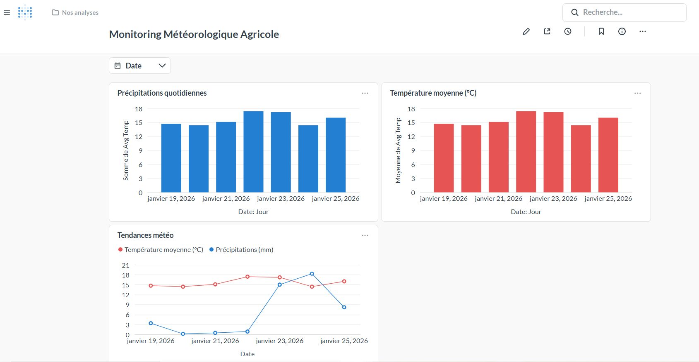
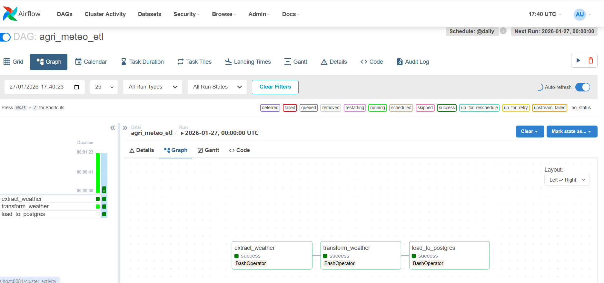
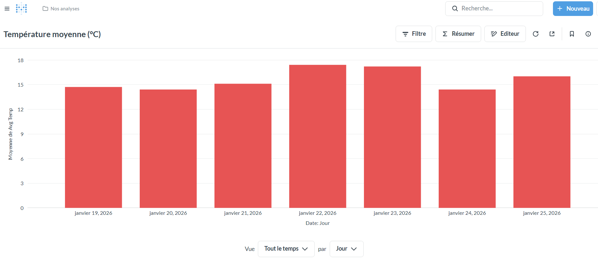
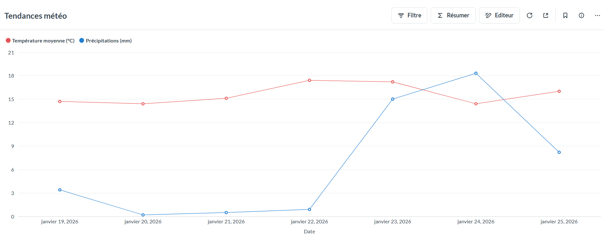

# 🌾 Agri-Meteo Big Data Pipeline

> Pipeline ETL Big Data automatisé pour collecter, transformer et analyser des données météorologiques avec **Airflow, Spark, PostgreSQL et Metabase**

[](https://opensource.org/licenses/MIT)
[](https://www.python.org/downloads/)
[](https://spark.apache.org/)
[](https://airflow.apache.org/)

---

## 🎯 Vision Métier

Les données météorologiques sont souvent dispersées, volumineuses et difficiles à exploiter. Ce projet fournit une **chaîne de traitement complète** et **entièrement automatisée** transformant les données brutes en **KPI exploitables**, prêts pour la Business Intelligence et l'aide à la décision agricole.

**Problématique résolue :** Comment anticiper les risques climatiques (sécheresse, inondations, stress thermique) pour optimiser la gestion agricole ?

---

## 🏗️ Architecture du Pipeline
```
┌─────────────────────┐
│   Open-Meteo API   │  ← Source de données
└──────────┬──────────┘
           │
┌──────────▼──────────┐
│  Apache Airflow     │  ← Orchestration (@daily)
│  ┌────────────────┐ │
│  │  Extract       │ │  → Récupération données météo
│  └────────┬───────┘ │
│  ┌────────▼───────┐ │
│  │  Transform     │ │  → Nettoyage + Calculs KPI (Spark)
│  └────────┬───────┘ │
│  ┌────────▼───────┐ │
│  │  Load          │ │  → Chargement PostgreSQL + Parquet
│  └────────────────┘ │
└─────────────────────┘
           │
    ┌──────┴──────┐
    │             │
┌───▼────┐   ┌───▼────────┐
│  Data  │   │ PostgreSQL │
│  Lake  │   │   (OLAP)   │
│(Parquet)│   └─────┬──────┘
└────────┘         │
              ┌────▼──────────────────┐
              │  Visualisation BI     │
              │  • Metabase           │
              │  • Superset (opt.)    │
              └───────────────────────┘
```

**Architecture microservices** : 5 conteneurs Docker orchestrés

---

## 🛠️ Stack Technique

### Core Technologies
- **Orchestration** : Apache Airflow 2.8.1 (LocalExecutor)
- **Big Data Processing** : Apache Spark 3.4.1 (PySpark)
- **Database** : PostgreSQL 15 (OLAP + Airflow metadata)
- **Data Visualization** : Metabase + Apache Superset
- **Containerization** : Docker & Docker Compose
- **Languages** : Python 3.8+, SQL

### Libraries & Tools
- **ETL** : PySpark, Pandas, SQLAlchemy
- **Data Formats** : Parquet (Data Lake), CSV (staging), JDBC (PostgreSQL)
- **API** : Open-Meteo API (weather data)
- **Networking** : Docker custom network (agri-network)

---

## ⚙️ Fonctionnalités Clés

✅ **Automatisation complète** – Pipeline ETL exécuté quotidiennement (@daily scheduling)  
✅ **Traitement distribué** – Apache Spark pour gérer des volumes importants  
✅ **KPI Métier** – Calcul automatique de risques climatiques (HIGH/MEDIUM/LOW)  
✅ **Dual Storage** – Data Lake (Parquet) + Data Warehouse (PostgreSQL)  
✅ **Monitoring** – Spark UI + Airflow UI pour supervision  
✅ **Dashboards interactifs** – Visualisations temps réel avec Metabase  
✅ **Scalabilité** – Architecture prête pour multi-régions et volumes croissants

---

## 📊 Indicateurs & KPI Produits

### Métriques Calculées
- **Température moyenne quotidienne** (°C)
- **Précipitations cumulées** (mm)
- **Risque climatique** (HIGH/MEDIUM/LOW)
- **Tendances et corrélations** température-précipitations

### Règles Métier (Climate Risk KPI)
| Précipitations | Niveau de Risque | Impact Agricole |
|----------------|------------------|-----------------|
| < 1 mm         | 🔴 **HIGH**      | Sécheresse - Irrigation urgente |
| 1-5 mm         | 🟡 **MEDIUM**    | Modéré - Surveillance |
| 5-10 mm        | 🟢 **LOW**       | Optimal |
| > 10 mm        | 🔴 **HIGH**      | Inondation - Drainage nécessaire |

---

## 📸 Captures d'écran

### Dashboard Metabase

*Dashboard complet : Température, Précipitations et Corrélations*

### Pipeline Airflow (Succès)

*Pipeline ETL exécuté avec succès - 3 tâches validées*

### Analyses Détaillées
<table>
  <tr>
    <td width="50%">
      
      <p align="center"><i>Température moyenne par jour</i></p>
    </td>
    <td width="50%">
      
      <p align="center"><i>Corrélation Température/Précipitations</i></p>
    </td>
  </tr>
</table>

---

## 📁 Structure du Projet
```
agri-meteo-bigdata-pipeline/
│
├── airflow/                        # Orchestration
│   ├── dags/
│   │   └── agri_meteo_etl.py      # DAG principal (@daily)
│   ├── logs/                       # Logs Airflow
│   ├── plugins/
│   ├── Dockerfile                  # Custom Airflow + Docker CLI
│   └── docker-compose.airflow.yml
│
├── docker/                         # Infrastructure
│   ├── Dockerfile                  # Spark + PostgreSQL JDBC
│   ├── docker-compose.yml          # Spark, Postgres, Metabase
│   └── requirements.txt            # Dépendances Python
│
├── scripts/                        # Scripts ETL
│   ├── extract.py                  # Extraction API Open-Meteo
│   ├── transform.py                # Transformation PySpark
│   └── load.py                     # Chargement PostgreSQL
│
├── data/
│   ├── raw/                        # CSV bruts (staging)
│   └── processed/                  # Parquet partitionné (Data Lake)
│
├── dashboard/
│   └── screenshots/                # Captures Metabase
│
├── notebooks/                      # (Optionnel) Exploration
│   └── exploration.ipynb
│
├── config/
│   └── config.yaml                 # Configuration (si nécessaire)
│
├── requirements.txt
├── README.md
└── .gitignore
```

---

## 🚀 Installation & Démarrage

### Prérequis
- **Docker** (version 20.10+) & **Docker Compose** (version 2.0+)
- **4 GB RAM** minimum recommandé
- **Ports disponibles** : 3000, 5432, 7077, 8080, 8081, 8088

### 1️⃣ Cloner le Projet
```bash
git clone https://github.com/biko2020/agri-meteo-bigdata-pipeline.git
cd agri-meteo-bigdata-pipeline
```

### 2️⃣ Créer le Réseau Docker
```bash
docker network create agri-network
```

### 3️⃣ Démarrer les Services
```bash
# Lancer Spark, PostgreSQL et Metabase
docker-compose -f docker/docker-compose.yml up -d

# Lancer Airflow (orchestration)
docker-compose -f airflow/docker-compose.airflow.yml up -d

# Vérifier que tous les conteneurs sont actifs
docker ps
```

### 4️⃣ Accéder aux Interfaces

| Service | URL | Credentials |
|---------|-----|-------------|
| **Airflow** | http://localhost:8081 | admin / admin |
| **Metabase** | http://localhost:3000 | (première connexion) |
| **Spark UI** | http://localhost:8080 | - |
| **Superset** (opt.) | http://localhost:8088 | admin / admin |

### 5️⃣ Exécuter le Pipeline

#### Option A : Via Airflow UI (Recommandé)
1. Accédez à http://localhost:8081
2. Activez le DAG `agri_meteo_etl`
3. Cliquez sur le bouton **Play** pour déclencher manuellement
4. Surveillez l'exécution (3 tâches : extract → transform → load)

#### Option B : Manuellement (pour tests)
```bash
# Extraction
docker exec spark python3 /app/scripts/extract.py

# Transformation (Spark)
docker exec spark spark-submit /app/scripts/transform.py

# Chargement PostgreSQL
docker exec spark python3 /app/scripts/load.py
```

### 6️⃣ Vérifier les Données
```bash
# Connexion PostgreSQL
docker exec -it postgres psql -U postgres -d agri_db

# Lister les tables
\dt

# Afficher les données
SELECT * FROM weather_kpi ORDER BY date;
```

---

## 🔄 Flux du Pipeline ETL

### 1. **Extract** (`extract.py`)
- **Source** : API Open-Meteo (latitude: 33.6, longitude: -7.6 - Casablanca)
- **Données** : Température max, Précipitations (7 jours)
- **Output** : `/app/data/raw/weather.csv`
- **Durée** : ~30 secondes

### 2. **Transform** (`transform.py`)
- **Engine** : PySpark (traitement distribué)
- **Opérations** :
  - Nettoyage (dropna)
  - Agrégations (avg température, avg précipitations)
  - Calcul KPI `climate_risk` (HIGH/MEDIUM/LOW)
- **Output** : 
  - Parquet partitionné → `/app/data/processed/weather/`
  - PostgreSQL → table `weather_kpi` (via JDBC)
- **Durée** : ~1-2 minutes

### 3. **Load** (`load.py`)
- **Source** : Parquet
- **Target** : PostgreSQL (`agri_db.weather_kpi`)
- **Method** : SQLAlchemy bulk insert
- **Durée** : ~30 secondes

**⏱️ Temps total du pipeline : 2-5 minutes**

---

## 📈 Configuration Metabase

### Connexion à la Base de Données

1. Accédez à Metabase : http://localhost:3000
2. **Admin** → **Databases** → **Add database**
3. Configurez :
   - **Database type** : PostgreSQL
   - **Name** : AgriMeteo
   - **Host** : `postgres`
   - **Port** : `5432`
   - **Database name** : `agri_db`
   - **Username** : `postgres`
   - **Password** : `postgres`

4. Cliquez sur **Save** puis **Sync database schema now**

### Créer le Dashboard

Consultez les captures d'écran dans `dashboard/screenshots/` pour reproduire :
- Bar Chart : Température moyenne
- Table : Précipitations quotidiennes
- Line Chart : Corrélation température/précipitations

---

## 💼 Compétences Démontrées

Ce projet illustre une maîtrise complète de :

### Data Engineering
- Architecture ETL moderne (Extract-Transform-Load)
- Traitement Big Data distribué (Spark)
- Modélisation de données (Star Schema OLAP)
- Data Lake vs Data Warehouse

### DevOps & Infrastructure
- Conteneurisation Docker
- Orchestration multi-services (Docker Compose)
- Networking (custom Docker networks)
- CI/CD ready (automatisation complète)

### Orchestration & Automation
- Apache Airflow (DAGs, scheduling, monitoring)
- Gestion des dépendances entre tâches
- Retry policies et error handling

### Business Intelligence
- Dashboarding interactif (Metabase)
- Calcul de KPI métier
- Data storytelling

---

## 🎓 Cas d'Usage Professionnels

Ce pipeline est directement applicable pour :

✅ **Agriculture** – Optimisation irrigation, prévision récoltes  
✅ **Énergie** – Prévision production solaire/éolienne  
✅ **Assurance** – Évaluation risques climatiques  
✅ **Supply Chain** – Anticipation perturbations météo  
✅ **Smart Cities** – Gestion ressources urbaines  

---

## 🔮 Améliorations Futures

### Court Terme
- [ ] Tests unitaires (pytest) + tests d'intégration
- [ ] Logging avancé (ELK stack)
- [ ] Alerting automatique (email/Slack) sur seuils KPI

### Moyen Terme
- [ ] Machine Learning : Prévisions météo J+7 (Prophet, LSTM)
- [ ] API REST (FastAPI) pour consommation externe
- [ ] Multi-régions : Scraping de 10+ villes
- [ ] CDC (Change Data Capture) pour mises à jour incrémentales

### Long Terme
- [ ] Migration Cloud (AWS EMR / GCP Dataproc)
- [ ] Streaming temps réel (Kafka + Spark Streaming)
- [ ] Data Quality monitoring (Great Expectations)
- [ ] Monitoring infra (Prometheus + Grafana)

---

## 📦 Dépendances Python
```txt
# Big Data & Processing
pyspark==3.4.1

# Data Manipulation
pandas
pyarrow
fastparquet

# Database
sqlalchemy
psycopg2-binary

# API & Utils
requests
pyyaml
```

---

## 🐛 Troubleshooting

### Erreur : "Cannot connect to Docker daemon"
**Solution** : Assurez-vous que Docker Desktop est démarré et que `/var/run/docker.sock` est monté dans Airflow.

### Erreur : "ClassNotFoundException: org.postgresql.Driver"
**Solution** : Reconstruisez le conteneur Spark avec `docker-compose -f docker/docker-compose.yml build`

### Metabase ne voit pas les tables
**Solution** : Cliquez sur "Sync database schema now" dans Admin → Databases après l'exécution du pipeline.

### Pipeline lent (>10 minutes)
**Solution** : Augmentez les ressources Docker (4 GB RAM minimum recommandé).

---

## 📄 Licence

MIT License - Libre d'utilisation pour projets personnels et commerciaux.

---

## 👤 Auteur

**AIT OUFKIR BRAHIM**  
*Data Engineer | Big Data Developer*

- 📧 Email : [aitoufkirbrahimab@gmail.com](mailto:aitoufkirbrahimab@gmail.com)
- 💼 LinkedIn : [linkedin.com/in/brahim-ait-oufkir](https://linkedin.com/in/brahim-ait-oufkir)
- 🐙 GitHub : [github.com/biko2020](https://github.com/biko2020)

---
